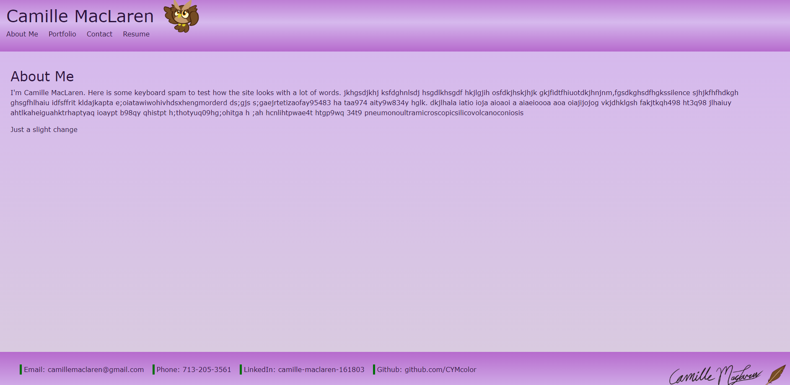
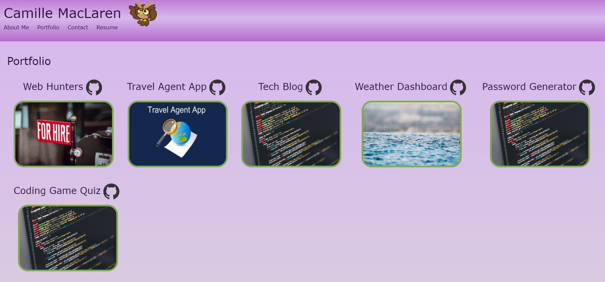

# Camille-Y-M-Portfolio

## Description/Link
This is a website for a Camille MacLaren's portfolio.  

Link to deployed site: https://cymcolor.github.io/camille-y-m-portfolio/

## Table of Contents
- [Installation](#installation)
- [Usage](#usage)
- [License](#license)
- [Contributing](#contributing)
- [Contact](#contact)

## Installation
Download code from the GitHub repository. Have Node.js installed. Link to Node.js downloads: https://nodejs.dev/en/download/. Then in the terminal install all the npm packages by inputting npm install. 

Create react app by running npm create-react-app {directory-name}.

## Usage
This porfolio contains an About Me, Portfolio, Contact, and Resume page. The About Me page gives a bio of the owner. The Porfolio page that contains the owner's works. The user can click on the thumbnail of the work to be taken to the deployed site or they can click on the Github logo next to the works name to be taken to the work's Github repo page. The Conact page is a form which the user can input a name, an email, and a message. This site currently does not have an API functionality, so the form submission will do nothing. The Resume page will show the owner's resume and a button that will allow ther user to download the owner's resume.

Screenshot of About Me page: 

Screenshot of Portfolio page: 

## License
 This application is covered under MIT License.

You can click on the badge for further information.

## Contributing
Npm Packages used:
- axios: will handle API requests
- bootstrap: CSS framework
- Dotenv: handles environment variables
- pretty: helps format code
- react: makes the app a react app
- web-vitals:

## Contact
GitHub profile: https://github.com/CYMcolor
